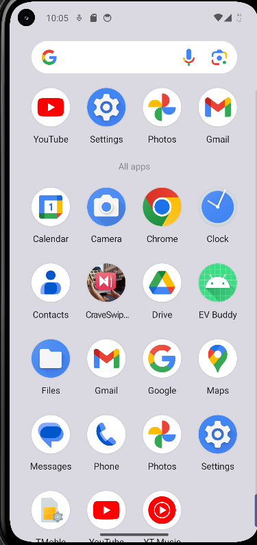
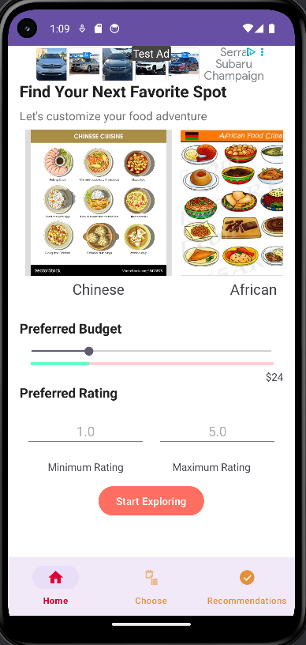
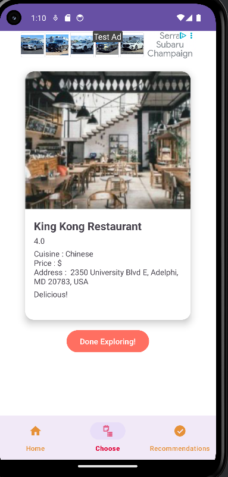
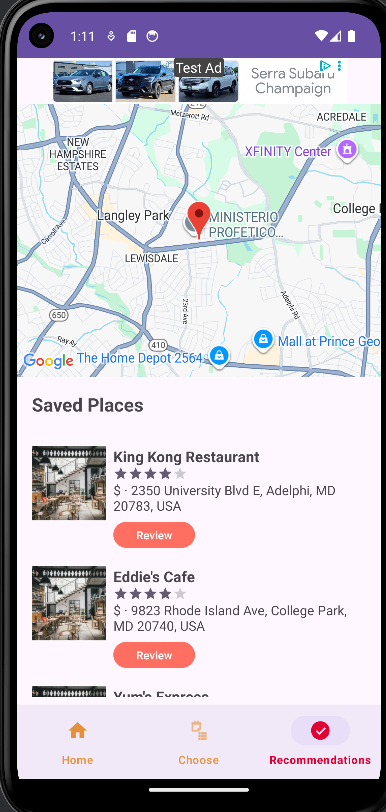

# 🍽️ CraveSwipe – The Tinder for Restaurants

**CraveSwipe** is a fun and intuitive Android app that helps users discover nearby restaurants using a Tinder-style swipe interface. Instead of scrolling through endless lists, users can swipe right to like or left to skip, making food discovery fast, visual, and personalized.

---

## 🚀 Overview

CraveSwipe transforms the way users explore dining options by offering one restaurant at a time in a clean, swipeable UI. The app uses user preferences and interaction history to recommend restaurants that match their taste, and stores favorites in a map-based view for easy access.

---

## 🎯 Features

- ✅ **Tinder-Style Swiping** – One card per restaurant. Swipe right to like, left to skip.
- 🍕 **Personalized Discovery** – Recommendations improve over time based on your interactions.
- 🍣 **Preference Onboarding** – Select preferred cuisines and price range to tailor results.
- 🌍 **Favorites View** – Liked restaurants appear on a map and a scrollable list.
- 📲 **Detailed Cards** – Each card includes name, image, cuisine type, price level, and rating.
- 🔥 **Smooth UI** – Modern Kotlin-based UI with clean animations and intuitive gestures.

---

## 📸 Screenshots

## 🧑‍💻 Tech Stack

- **Language**: Kotlin  
- **Platform**: Android (Jetpack libraries, Android Studio)  
- **UI**: XML Layouts, ViewModels, LiveData, Navigation Component  
- **Backend**: Firebase Firestore (NoSQL database for storing user data and restaurant info)  
- **Authentication**: Firebase Auth (optional or planned for personalization)  
- **Maps**: Google Maps SDK for Android (for the Favorites map view)  
- **Image Loading**: Glide or Coil (for loading restaurant images efficiently)  
- **Architecture**: MVVM (Model-View-ViewModel)  

---

## 🛠️ Getting Started

### Open the project in Android Studio

### Set up Firebase:

1. Download `google-services.json` from the [Firebase Console](https://console.firebase.google.com/) and place it inside the `/app/` directory.
2. In the Firebase Console:
   - Enable **Cloud Firestore** (for storing restaurant data and favorites).
   - Enable **Authentication** (Email/Password or Google Sign-In, if used).
3. Add your app’s **SHA-1 key** in the Firebase project settings under Android configuration.
4. Make sure `google-services` is applied in your `build.gradle` files.
5. **Sync Gradle** in Android Studio.
6. Run the app on an Android emulator or a physical device.

---

## 👥 The Team

- Arjun  
- Shashank  
- Suyash  
- Maukha  

---

## 🌟 Future Enhancements

- 🔐 Firebase Authentication for user login and personalized favorites  
- 🧭 Filters for distance, open hours, ratings, etc.  
- 📤 Social sharing for saved restaurants  
- 🛎️ Integration with restaurant booking APIs (Zomato, OpenTable, etc.)  
- 🗂️ Offline caching and performance improvements  

---

## 📄 License

This project is licensed under the **MIT License** – see the [LICENSE](LICENSE) file for details.

